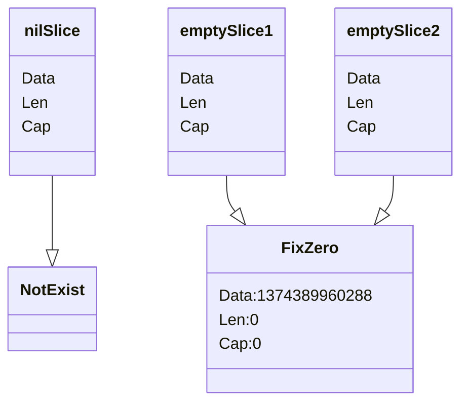

# Difference Between Nil Slice and Empty Slice

```mermaid
classDiagram
nilSlice --|> NotExist
emptySlice1 --|> FixZero
emptySlice2 --|> FixZero

class emptySlice1{
    Data
    Len
    Cap
}
class emptySlice2{
    Data
    Len
    Cap
}
class nilSlice{
    Data
    Len
    Cap
}
class FixZero{
    Data:1374389960288
    Len:0
    Cap:0
}
```